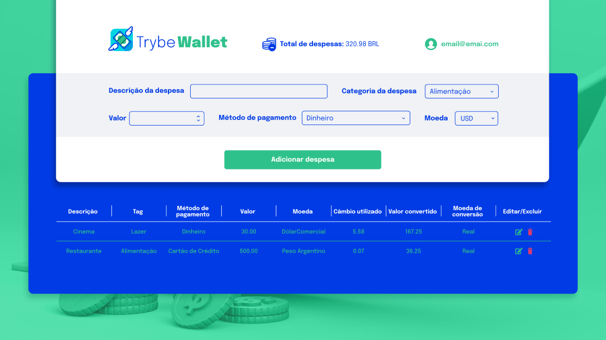

<h1><strong>TrybeWallet</strong></h1>

<h2><strong>Descrição</strong></h2>

  O TrybeWallet é uma aplicação de carteira de controle de gastos com conversor de moedas. Nela, a pessoa usuária consegue cadastrar despesas, editar ou remover gastos, acompanhar uma tabela detalhada, e visualizar o total convertido para uma moeda selecionada.

<h2><strong>Funcionalidades</strong></h2>
<ul>
  <li align="justify"><strong>Adicionar</strong>, <strong>editar</strong> e <strong>remover</strong> um gasto</li>
  <li align="justify">Visualizar a <strong>tabela de gastos</strong> com detalhes (descrição, categoria, método de pagamento, valor, moeda)</li>
  <li align="justify">Visualizar o <strong>total de gastos convertido</strong> para uma moeda de referência</li>
  <li align="justify">Gerenciamento de estado global com <strong>Redux</strong> (store, reducers, actions, dispatchers)</li>
  <li align="justify">Uso de <strong>hooks do React-Redux</strong> para leitura e manipulação do estado</li>
  <li align="justify">Integração com <strong>actions assíncronas</strong> para obter cotações e aplicar conversões</li>
</ul>

<h2><strong>Demonstração do Projeto</strong></h2>

  
  
   
  <a href="https://github.com/williandpg/trybewallet" target="_blank"><strong>Acesse a demonstração</strong></a>

<h2><strong>Tecnologias Utilizadas</strong></h2>
<ul>
  <li align="justify">
    <a href="https://react.dev/" target="_blank"><strong>React</strong></a>:
    Biblioteca utilizada para criação da interface e componentização da aplicação.
  </li>
  <li align="justify">
    <a href="https://redux.js.org/" target="_blank"><strong>Redux</strong></a>:
    Gerenciamento de estado global, com store, reducers e actions para controlar dados da carteira.
  </li>
  <li align="justify">
    <a href="https://react-redux.js.org/" target="_blank"><strong>React-Redux</strong></a>:
    Integração do Redux com React, utilizando hooks como <code>useDispatch</code> e <code>useSelector</code>.
  </li>
  <li align="justify">
    <a href="https://redux.js.org/usage/writing-logic-thunks" target="_blank"><strong>Redux Thunk</strong></a>:
    Middleware para <strong>actions assíncronas</strong> (ex.: buscar cotações e atualizar o estado).
  </li>
  <li align="justify">
    <a href="https://jestjs.io/" target="_blank"><strong>Jest</strong></a>:
    Framework de testes para validação de regras e comportamento da aplicação.
  </li>
  <li align="justify">
    <a href="https://testing-library.com/docs/react-testing-library/intro/" target="_blank"><strong>React Testing Library</strong></a>:
    Testes de interface focados na experiência do usuário e nos fluxos principais.
  </li>
</ul>

<h2><strong>Estrutura do Projeto</strong></h2>

A estrutura do projeto é organizada da seguinte forma:

<pre><code>/
├── src/
│   ├── components/
│   ├── pages/
│   ├── redux/
│   │   ├── actions/
│   │   ├── reducers/
│   │   └── store/
│   ├── services/ (ex.: integração com API de câmbio)
│   ├── tests/
│   └── App.js (ou App.jsx)
├── public/
└── README.html
</code></pre>

<h2><strong>Contato</strong></h2>

  <strong>Willian Gonçalves</strong> |
  <a href="https://www.linkedin.com/in/williandpg/" target="_blank"><strong>LinkedIn</strong></a> |
  <a href="https://github.com/williandpg" target="_blank"><strong>Github</strong></a> |
  <a href="https://williandpg.github.io/" target="_blank"><strong>Portfólio</strong></a> |
  <a href="mailto:goncalves.wdp@outlook.com" target="_blank"><strong>Email</strong></a>

<h2><strong>Créditos</strong></h2>

  Este projeto foi desenvolvido como parte do curso de Desenvolvimento Web Full Stack da Trybe, com foco em React e Redux, praticando fluxo de estado global, actions assíncronas e testes.

  
<strong>English Version</strong>

  <h1><strong>TrybeWallet</strong></h1>

  <h2><strong>Description</strong></h2>
  

    TrybeWallet is an expense tracking wallet application with a currency converter. Users can create, edit, and remove expenses, view them in a table, and check the converted total in a selected reference currency.
  

  <h2><strong>Features</strong></h2>
  <ul>
    <li align="justify"><strong>Add</strong>, <strong>edit</strong>, and <strong>remove</strong> an expense</li>
    <li align="justify">View an <strong>expenses table</strong> with detailed information</li>
    <li align="justify">View the <strong>converted total</strong> in a chosen reference currency</li>
    <li align="justify">Global state management using <strong>Redux</strong> (store, reducers, actions, dispatchers)</li>
    <li align="justify">Use <strong>React-Redux hooks</strong> to read and update global state</li>
    <li align="justify">Implement <strong>async actions</strong> to fetch exchange rates and apply conversions</li>
  </ul>

  <h2><strong>Project Demo</strong></h2>
  

    
    
     
    <a href="https://github.com/williandpg/trybewallet" target="_blank"><strong>Open the demo</strong></a>
  

  <h2><strong>Technologies Used</strong></h2>
  <ul>
    <li align="justify">
      <a href="https://react.dev/" target="_blank"><strong>React</strong></a>:
      Library used to build the UI with reusable components.
    </li>
    <li align="justify">
      <a href="https://redux.js.org/" target="_blank"><strong>Redux</strong></a>:
      Global state management with store, reducers, and actions.
    </li>
    <li align="justify">
      <a href="https://react-redux.js.org/" target="_blank"><strong>React-Redux</strong></a>:
      Redux bindings for React, using hooks like <code>useDispatch</code> and <code>useSelector</code>.
    </li>
    <li align="justify">
      <a href="https://redux.js.org/usage/writing-logic-thunks" target="_blank"><strong>Redux Thunk</strong></a>:
      Middleware to implement <strong>async actions</strong> (e.g., fetching exchange rates).
    </li>
    <li align="justify">
      <a href="https://jestjs.io/" target="_blank"><strong>Jest</strong></a>:
      Testing framework to validate application behavior.
    </li>
    <li align="justify">
      <a href="https://testing-library.com/docs/react-testing-library/intro/" target="_blank"><strong>React Testing Library</strong></a>:
      UI tests focused on user flows and accessibility-friendly queries.
    </li>
  </ul>

  <h2><strong>Project Structure</strong></h2>
  
The project structure is organized as follows:

  <pre><code>/
├── src/
│   ├── components/
│   ├── pages/
│   ├── redux/
│   │   ├── actions/
│   │   ├── reducers/
│   │   └── store/
│   ├── services/
│   ├── tests/
│   └── App.js (or App.jsx)
├── public/
└── README.html
</code></pre>

  <h2><strong>Contact</strong></h2>
  

    <strong>Willian Gonçalves</strong> |
    <a href="https://www.linkedin.com/in/williandpg/" target="_blank"><strong>LinkedIn</strong></a> |
    <a href="https://github.com/williandpg" target="_blank"><strong>Github</strong></a> |
    <a href="https://williandpg.github.io/" target="_blank"><strong>Portfolio</strong></a> |
    <a href="mailto:goncalves.wdp@outlook.com" target="_blank"><strong>Email</strong></a>
  

  <h2><strong>Credits</strong></h2>
  

    This project was developed as part of Trybe's Full Stack Web Development course, focusing on React and Redux, practicing global state flow, async actions, and testing.
  

